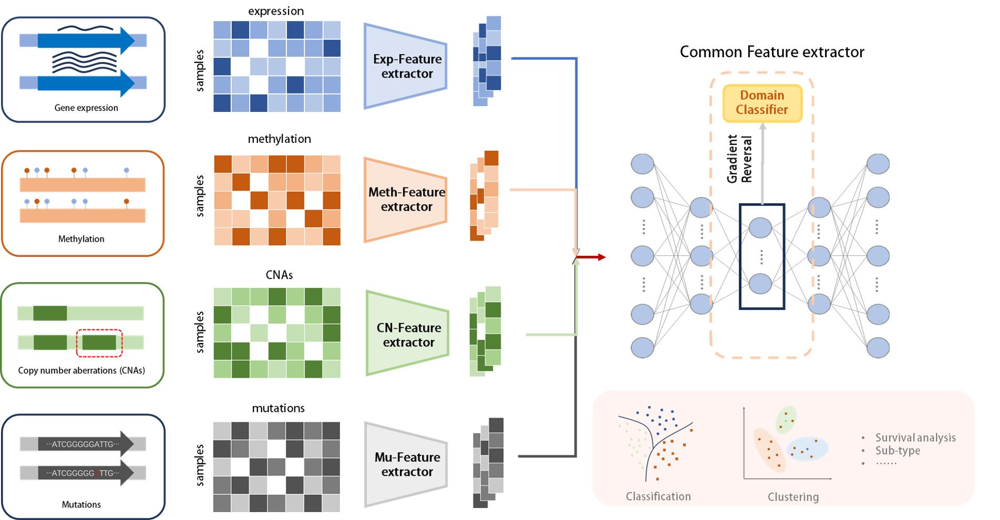

一个简单的梯度翻转层结合域分类器对多组学数据进行共性特征提取
===========================

- 特征提取器：单隐层的AutoEncoder
- 共性特征提取器： 梯度翻转+域分类器
- 简单的神经网络练习
- 仅供学习参考，如有不足欢迎指正

****

|作者|Lilian|
|---|---
|个人主页|[Lilian's HomePage](https://Lilian-tju.github.io/)

 

 模型结构图

 

**所用数据来自于TCGA数据库，已经过预处理的初步特征对齐**
